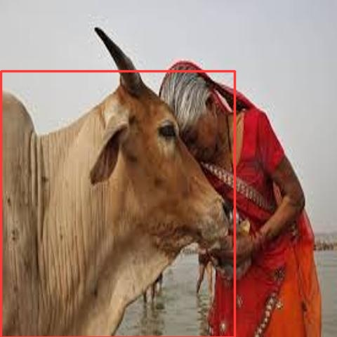
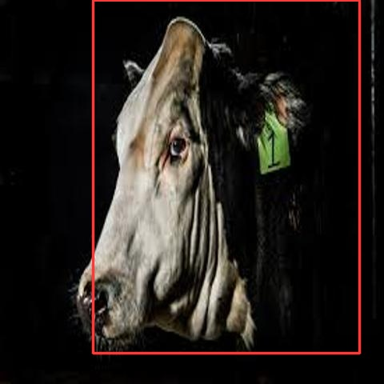
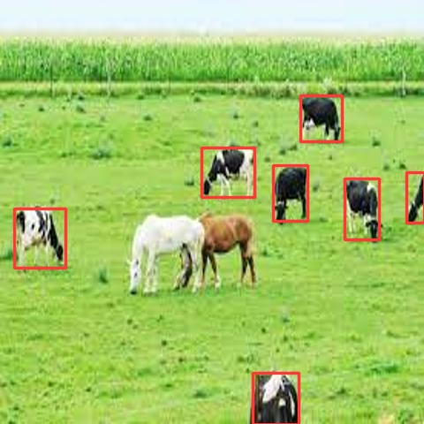
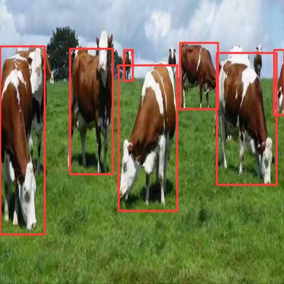
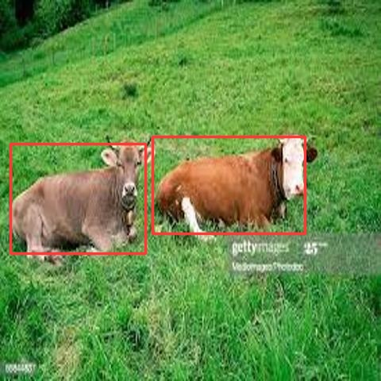
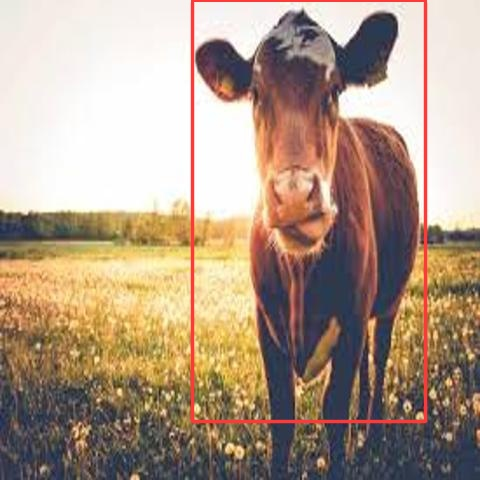
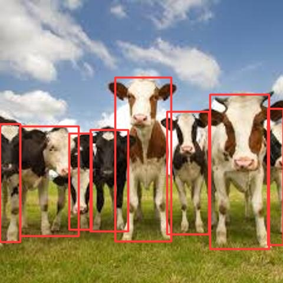
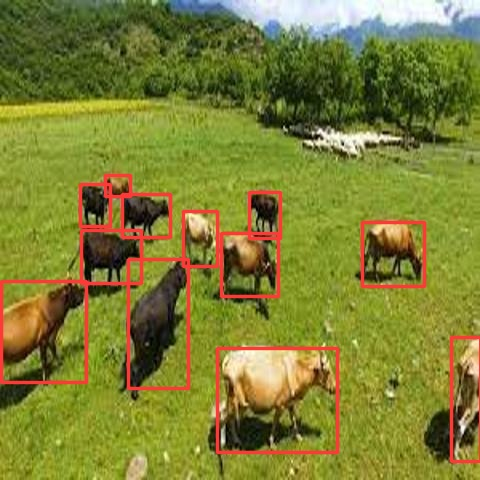
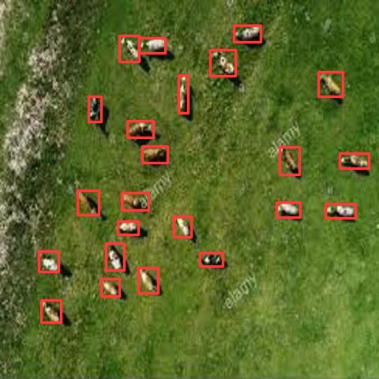
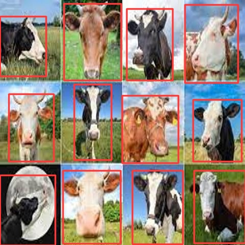

# Cattle-Detection

## Usage:
```bash
$ pip install -r requirements.txt
$ python3 detect.py --arguments 
```
>**_NOTE_** On Notebook use :
```python
!git clone link-to-repo
%run detect.py --arguments
```

## Help Log:
```
usage: detect.py [-h] [--weights WEIGHTS [WEIGHTS ...]] [--source SOURCE]
                 [--conf-thres CONF_THRES] [--iou-thres IOU_THRES] [--view-img] [--save-txt]
                 [--save-conf] [--line-thickness LINE_THICKNESS] [--hide-labels] [--hide-conf] [--nosave]
                 [--project PROJECT] [--name NAME] [--exist-ok]

optional arguments:
  -h, --help            show this help message and exit
  --weights WEIGHTS [WEIGHTS ...]
                        model.pt path(s)
  --source SOURCE       source
  --conf-thres CONF_THRES
                        object confidence threshold
  --iou-thres IOU_THRES
                        IOU threshold for NMS
  --view-img            display results
  --save-txt            save results to *.txt
  --save-conf           save confidences in --save-txt labels
  --line-thickness LINE_THICKNESS
                        bounding box thickness (pixels)
  --hide-labels         hide labels
  --hide-conf           hide confidences
  --nosave              do not save images/videos
  --project PROJECT     save results to project/name
  --name NAME           save results to project/name
  --exist-ok            existing project/name ok, do not increment
```

# Summary :

### Data Preparation : 
Images are scrapped from google, then selected manually based on resolution and annotation ability. **labelImg** tool is used for annotation in darknet format. Total of 2100 images are scrapped and after data cleansing 1575 images in the final dataset.

### Data Splitting : 
80% of total images are in the training set, 8% in the validation set, 12% in the test set. So splitting of data is 1260 in training, 126 in validation and 189 in test set.

### Augmentation : 
For each training image, 2 augmented images are generated using **Albumentations** library . According to study noise has had the most adverse effect on top-1 and top-5 accuracy classification, so we add Gaussian Noise randomly to training images with variance σ = [10, 30] and mean µ = 0 sampled for each channel independently. Blurriness, Shearing, Rotation, Translation, HSV hue and saturation, Scaling, Flip, Mosaic augmentations are used. Among those, bounding-box supportive augmentations are done on bounding-boxes only. Bbox supportive augmentation are those that affect only the bounding box region pixel. So finally 2620 images in the training set.

### Training : 
**Yolov5s** model is selected for training. Training is done in 3 phases, each phase for different resolution so that it generalizes well for small objects as well. Resolutions chosen are 480x480, 640x640 and 960x960. Each phase is divided into 2 parts, one half simple and second half with multi-scale training. Each phase is trained for 100 epochs so each half is trained for 50 epochs. So total training consists of 300 epochs. Multi-scale operation is done using bilinear interpolation. SGD is used as optimizers.

### Result :
|        | Precision | Recall | mAP@0.5 | 
|---     | ---  |---    |---     |
|Train | 95.7 | 94.6 | 94.7 | 
|Validation | 93.3 | 90.1 | 90.3 | 
|Test | 90.9 | 85.6 |86.4 |

### Inferences :

<p float="left">
  
   
</p>

<p float="left">
  
   
</p>

<p float="left">
  
   
</p>

<p float="left">
  
   
</p>

<p float="left">
  
   
</p>

**For more Inferences refer <a href="https://drive.google.com/drive/folders/1-JjbHJ3YAaXEWRJEa84Kxv69MEh3o-j8?usp=sharing" >Link</a>**

### References:
* [Prof. Biplav Srivastava's Github Repo](https://github.com/biplav-s)
* [Albumentations](https://albumentations.ai/)
* [labelImg](https://github.com/tzutalin/labelImg)
* [Yolov5](https://github.com/ultralytics/yolov5)